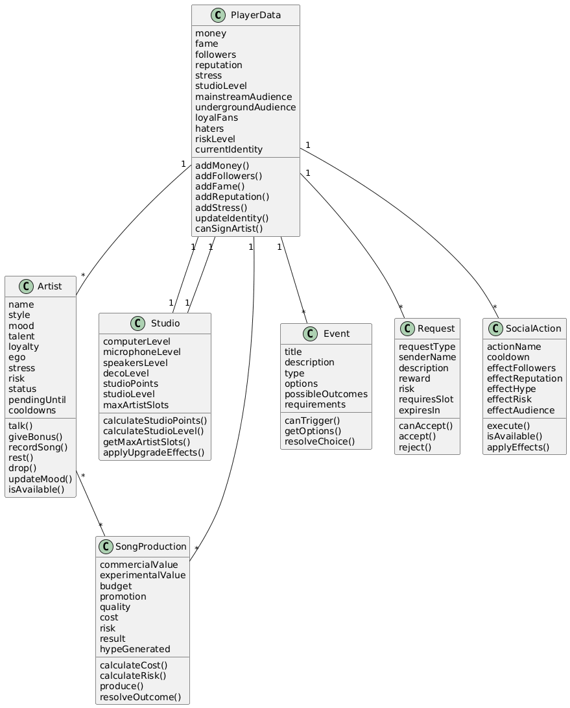
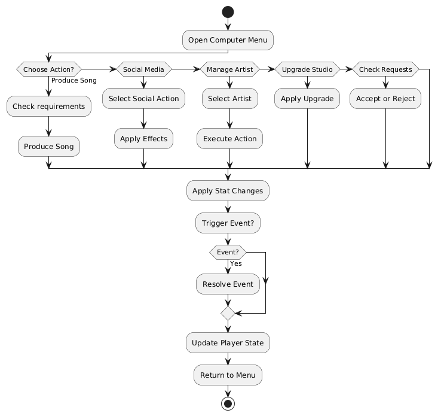

# 02_model_del_joc.md

## 1. Components principals del joc

Els components principals de **Grow A Industry** són els següents:

- **Jugador / Producció principal**: representa la persona que gestiona l’estudi i pren totes les decisions del joc.
- **Artistes**: persones que es poden fitxar, gestionar i fer créixer dins del projecte musical.
- **Estudi**: conjunt de millores, nivell i capacitat del sistema de producció.
- **Cançons / Produccions**: resultats de les accions creatives del jugador i dels artistes.
- **Esdeveniments**: situacions aleatòries o derivades de les decisions del jugador que afecten el progrés.
- **Sistema de xarxes socials**: accions relacionades amb promoció, comunitat i creixement de públic.
- **Sistema de sol·licituds / oportunitats**: artistes o oportunitats que arriben al jugador segons el seu progrés.

Aquests components formen el nucli del joc i es relacionen entre si per generar el bucle principal de gestió, producció i creixement.

---

## 2. Entitats identificades

Les entitats principals identificades per al joc són:

1. **PlayerData**
2. **Artist**
3. **Studio**
4. **SongProduction**
5. **Event**
6. **Request**
7. **SocialAction**

---

## 3. Atributs clau de cada entitat

### 3.1. PlayerData

- `money`
- `fame`
- `followers`
- `reputation`
- `stress`
- `studioLevel`
- `mainstreamAudience`
- `undergroundAudience`
- `loyalFans`
- `haters`
- `riskLevel`
- `artists`
- `currentIdentity`

### 3.2. Artist

- `name`
- `style`
- `mood`
- `talent`
- `loyalty`
- `ego`
- `stress`
- `risk`
- `status`
- `pendingUntil`
- `cooldowns`

### 3.3. Studio

- `computerLevel`
- `microphoneLevel`
- `speakersLevel`
- `decoLevel`
- `studioPoints`
- `studioLevel`
- `maxArtistSlots`

### 3.4. SongProduction

- `commercialValue`
- `experimentalValue`
- `budget`
- `promotion`
- `quality`
- `cost`
- `risk`
- `result`
- `hypeGenerated`

### 3.5. Event

- `title`
- `description`
- `type`
- `options`
- `possibleOutcomes`
- `requirements`

### 3.6. Request

- `requestType`
- `senderName`
- `description`
- `reward`
- `risk`
- `requiresSlot`
- `expiresIn`

### 3.7. SocialAction

- `actionName`
- `cooldown`
- `effectFollowers`
- `effectReputation`
- `effectHype`
- `effectRisk`
- `effectAudience`

---

## 4. Accions, mètodes o funcions principals

(Contenido igual — ya está bien estructurado, no tocamos aquí)

---

## 5. Explicació del diagrama de classes

El diagrama de classes representa les entitats principals del joc i les seves relacions.

<p align="center">
  
</p>

Aquest diagrama mostra com el sistema està estructurat a nivell de dades i responsabilitats.

La classe central és **PlayerData**, que gestiona l’estat global del joc. A partir d’aquesta, es relacionen la resta d’entitats:

- `PlayerData` conté una col·lecció d’`Artist`
- `PlayerData` té associat un `Studio`
- `PlayerData` interactua amb `SongProduction`, `Event`, `Request` i `SocialAction`
- `Studio` defineix els límits del jugador (slots i nivell)
- `Artist` participa en produccions i accions

Aquest disseny permet una arquitectura modular i fàcil d’escalar.

---

## 6. Explicació del diagrama de comportament

S’ha utilitzat un **diagrama d’activitat** per representar el bucle del joc.

<p align="center">
  
</p>

El flux representat és:

1. El jugador accedeix al sistema
2. Escull una acció (produir, gestionar, social, etc.)
3. El sistema valida requisits i cooldowns
4. Executa l’acció
5. Calcula resultats
6. Pot generar un esdeveniment
7. Actualitza l’estat
8. Torna al bucle

Aquest model reflecteix correctament que el joc és un sistema iteratiu de decisions.

---

## 7. Correspondència entre diagrames i codi futur

- `PlayerData` → gestor global
- `Artist` → classe d’entitat amb estat i accions
- `Studio` → sistema de nivell i capacitat
- `SongProduction` → sistema de càlcul de resultats
- `Event` → sistema d’esdeveniments
- `Request` → sistema d’oportunitats
- `SocialAction` → sistema de xarxes socials

El projecte es dividirà en múltiples mòduls per responsabilitat.

---

## 8. Estructura inicial del repositori

```text
grow-a-industry/
├─ README.md
├─ default.project.json
├─ aftman.toml
├─ .gitignore
├─ src/
│  ├─ client/
│  │  ├─ init.client.luau
│  │  ├─ ui/
│  │  │  ├─ MainMenu.luau
│  │  │  ├─ ComputerMenu.luau
│  │  │  ├─ ArtistsMenu.luau
│  │  │  ├─ ManageArtistMenu.luau
│  │  │  ├─ SocialMediaMenu.luau
│  │  │  └─ ResultPopup.luau
│  │  └─ systems/
│  │     ├─ InteractionSystem.luau
│  │     └─ UpgradeVisibility.luau
│  ├─ server/
│  │  └─ init.server.luau
│  └─ shared/
│     ├─ PlayerDataManager.luau
│     ├─ StudioSystem.luau
│     ├─ ArtistSystem.luau
│     ├─ SongProductionSystem.luau
│     ├─ SocialMediaSystem.luau
│     ├─ EventSystem.luau
│     ├─ RequestSystem.luau
│     └─ Config.luau
├─ docs/
│  ├─ 01_idea_i_abast.md
│  └─ 02_model_del_joc.md
└─ diagrames/
   ├─ diagrama_classes.png
   └─ diagrama_comportament.png