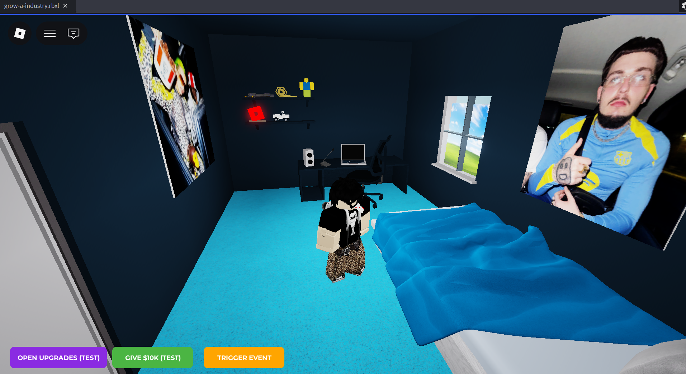
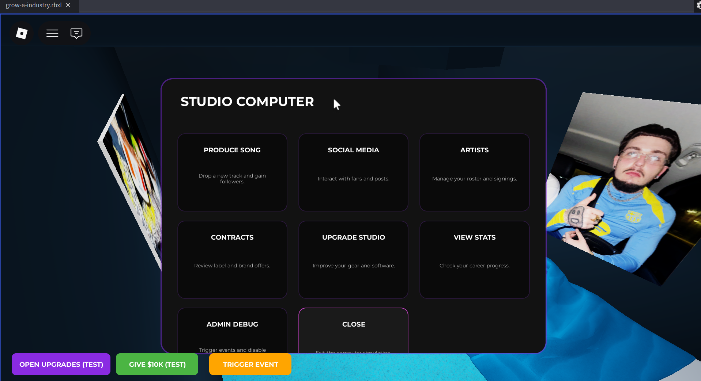

# 03_entorn_i_prototip.md

# 1. Entorn de desenvolupament utilitzat

Per al desenvolupament del projecte **Grow A Industry** s’ha utilitzat el següent entorn de treball:

- **Motor de joc:** Roblox Studio
- **Llenguatge de programació:** Luau (Lua adaptat per Roblox)
- **Editor de codi:** Visual Studio Code
- **Control de versions:** Git + GitHub
- **Sistema de sincronització:** Rojo
- **Gestor d’eines:** Aftman

També s’han utilitzat diferents eines d’intel·ligència artificial per ajudar en:
- generació de prototips;
- arquitectura del sistema;
- revisió de codi;
- plantejament de sistemes de simulació;
- millora de la interfície.

---

# 2. Configuració bàsica de l’entorn

L’estructura inicial del projecte s’ha creat utilitzant Rojo per separar correctament els scripts del projecte.

L’estructura principal és la següent:

```text
grow-a-industry/
├─ src/
│  ├─ client/
│  ├─ server/
│  └─ shared/
├─ docs/
├─ diagrames/
├─ default.project.json
├─ aftman.toml
└─ README.md
```

La sincronització entre Visual Studio Code i Roblox Studio es fa mitjançant Rojo.

GitHub s’utilitza per guardar versions del projecte i mantenir un historial dels canvis realitzats.

3. Decisions inicials d’implementació

Durant aquesta fase s’han pres diverses decisions importants relacionades amb l’arquitectura i el funcionament del joc.

3.1. Arquitectura modular

S’ha decidit separar el projecte en diferents sistemes independents:

SongSystem
ArtistSystem
SocialMediaSystem
EventBus
ModifierSystem
PressureSystem
StateResolver
PlayerDataManager

Aquesta decisió permet:

mantenir el codi més ordenat;
facilitar futurs canvis;
evitar scripts molt grans;
permetre que diferents sistemes interactuïn entre si.
3.2. Arquitectura basada en esdeveniments

Inicialment, diferents sistemes modificaven directament les dades del jugador.

Posteriorment s’ha refactoritzat el projecte per utilitzar:

EventBus;
StateResolver;
ModifierSystem.

Ara els sistemes emeten esdeveniments i és el StateResolver qui aplica els canvis reals sobre les dades.

Flux actual:

Sistema → EventBus → StateResolver → PlayerDataManager

Això permet una arquitectura més escalable i coherent.

3.3. Sistema de simulació

S’ha decidit enfocar el joc cap a una simulació de la indústria musical basada en:

presa de decisions;
estrès;
reputació;
tendències;
xarxes socials;
relació amb artistes;
conseqüències persistents.

L’objectiu no és crear un simple “tycoon”, sinó una experiència on les decisions generin situacions emergents.

4. Funcionalitats implementades fins ara

Actualment el projecte ja disposa d’un prototip funcional amb diferents sistemes implementats.

4.1. Sistema de producció musical

El jugador pot:

interactuar amb l’ordinador de l’estudi;
produir cançons;
configurar diferents sliders;
obtenir resultats variables segons les decisions preses.

El sistema inclou:

probabilitats;
riscos;
hits;
flops;
viralitat;
estrès;
modificadors.
4.2. Sistema d’artistes

El joc permet:

descobrir artistes;
fitxar artistes;
gestionar-los;
parlar amb ells;
donar bonus;
fer-los descansar;
produir cançons.

També existeixen:

cooldowns;
estrès;
lleialtat;
ego;
esdeveniments aleatoris.
4.3. Sistema de xarxes socials

S’han implementat diferents accions socials:

TikTok
YouTube
Behind the scenes
Leak snippet
Twitter beef
Buy promotion
Respond to hate

Aquestes accions modifiquen:

followers;
hype;
reputació;
risc;
comunitat.
4.4. Sistema de millores de l’estudi

El jugador pot millorar:

ordinador;
micròfon;
altaveus;
decoració.

Aquestes millores afecten:

qualitat;
capacitat;
producció;
nivell de l’estudi.

També es reflecteixen visualment dins del mapa.

4.5. Sistema d’arquitectura interna

S’ha implementat:

EventBus;
StateResolver;
ModifierSystem;
MomentumSystem;
TrendSystem;
PressureSystem (en desenvolupament).

Aquest sistema permet crear mecàniques més complexes sense dependre directament de la interfície.

5. Evidències del treball realitzat
5.1. Captura del menú principal

Breu explicació:
Es mostra el menú principal del joc i l’accés a les diferents funcionalitats.

5.2. Captura del sistema de producció

Breu explicació:
El jugador pot modificar sliders i generar diferents tipus de cançons segons l’estratègia escollida.

5.3. Captura del sistema d’artistes

Breu explicació:
Sistema per gestionar artistes, cooldowns i diferents accions.

5.4. Captura del mapa i estudi

Breu explicació:
Vista general de l’estudi i de les millores visuals implementades.

5.5. Captura de logs i arquitectura

Breu explicació:
Es mostra el funcionament de l’arquitectura basada en EventBus i StateResolver.

6. Problemes trobats i solucions

Durant el desenvolupament han aparegut diferents problemes:

Problema	Solució
Cooldowns no s’actualitzaven	Sistema de refresh amb Heartbeat
Models físics es desmuntaven	Models ancorats i gestió de física
Massa mutacions directes de dades	Refactor amb EventBus
Menús sobreposats	Reestructuració de layouts
Codi difícil d’escalar	Arquitectura modular
7. Estat actual del prototip

Actualment el projecte compleix les condicions mínimes perquè:

existeix un prototip funcional;
es pot jugar;
hi ha interacció dins del mapa;
hi ha sistemes de gestió;
existeix persistència temporal de dades durant la sessió;
hi ha arquitectura modular;
el joc ja disposa d’un bucle principal funcional.

El projecte encara està en desenvolupament, però la base tècnica i jugable ja està implementada.

8. Properes passes

Les següents fases del desenvolupament se centraran en:

aprofundir el sistema de tendències;
afegir memòria persistent;
ampliar els esdeveniments reactius;
equilibrar el sistema econòmic;
afegir conseqüències a llarg termini;
millorar el feedback visual i sonor;
implementar guardat de partida.

# 3. Captures

