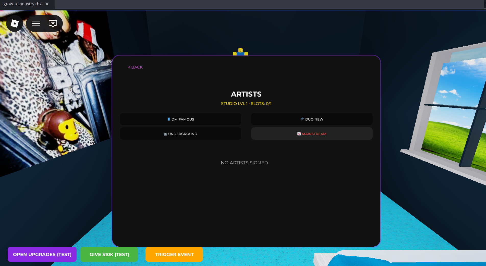
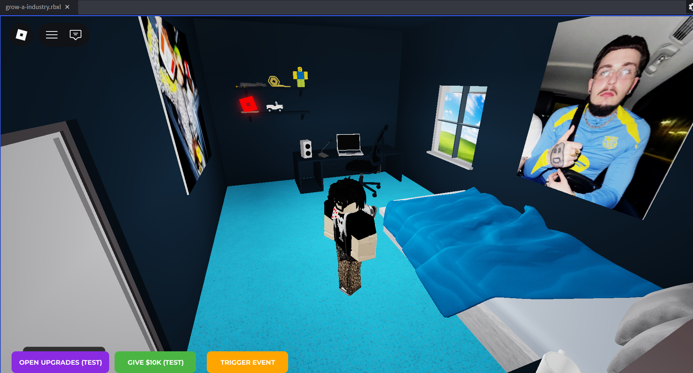
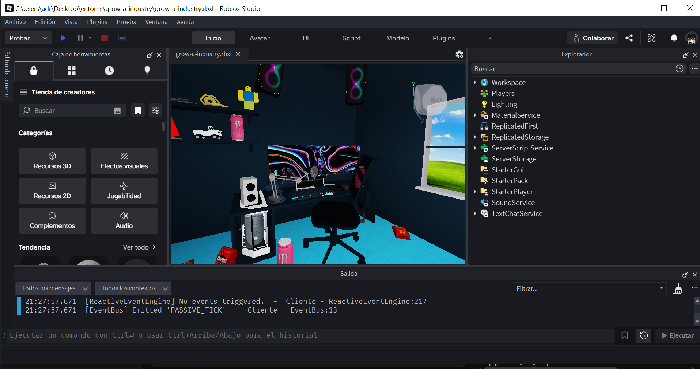
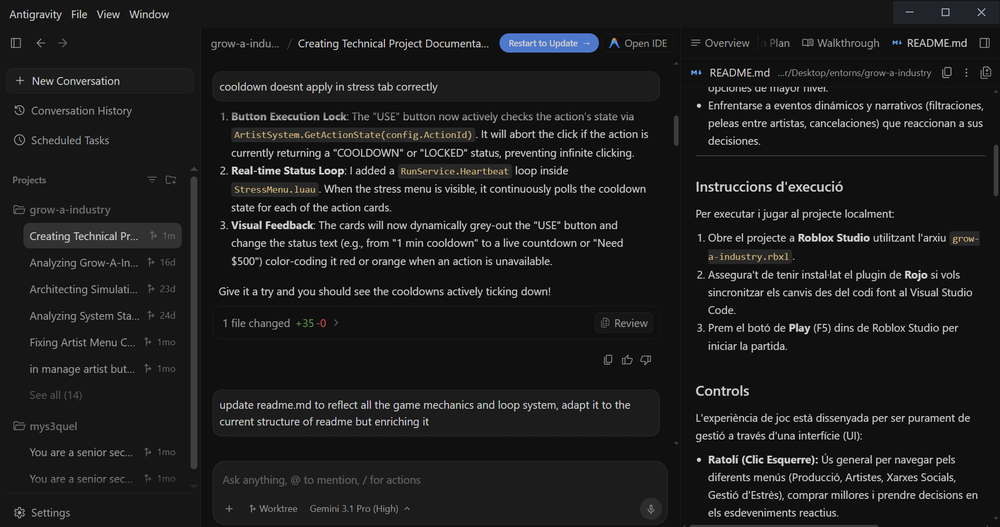

# Evidències del procés de treball

Aquest document i directori adjunta imatges, captures i fragments que demostren el desenvolupament del videojoc al llarg de tot el temps.

## 1. Captures del Joc en Funcionament
A continuació s'adjunten imatges del menú, el sistema de producció, el sistema d'artistes i el mapa general:

- **Menú principal:**
  
  
- **Sistema de producció:**
  

- **Sistema d'artistes:**
  

- **Vista general del mapa i l'estudi:**
  

## 2. Captures del Treball amb l'IDE
- **Roblox Studio**
  

- **Antigravity (IDE)**
  
  
## 3. Registre d'Errors (Bugs) i Resolucions
Durant la meitat del projecte, el sistema d'esdeveniments "s'empassava" les decisions perquè la pantalla ("ScreenGui") en què estava muntat (`MainMenu`) es destruïa en prémer PLAY.
* **Error Trobat:** L'usuari prenia una decisió, però com l'escript s'esborrava la interfície de les notificacions quan l'usuari entrava a l'espai 3D, cap popup apareixia. L'event de fons s'activava de forma "invisible" per al jugador.
* **Solució implementada:** S'ha redissenyat la inicialització. Es va separar l'instanciació de la `NotificationQueue.luau` creant-li el seu propi `ScreenGui` marcat com a "persistent" (`ResetOnSpawn = false` i sobrevivint al FadeOut del Menú).

## 4. Ús de la Intel·ligència Artificial
L'ús de la Intel·ligència Artificial en la concepció d'aquest projecte ha sigut col·laborativa i de suport estructural per al llenguatge Luau (una variació moderna de Lua).

Exemples d'ús reals:
1. **Detecció d'Asimetries d'Estructura:** Per a l'esdeveniment global del joc, existia un error pel qual l'arbre `NarrativeChainSystem` posava la taula `Options` dintre de `Consequences`, mentre que el `ReactiveEventEngine` les volia buscar al top-level directament. L'IA ha servit per llegir aquestes discrepàncies al codi del bus i suggerir un pegat unificador a la funció `ShowEvent(eventData)`.
2. **Refinament del Sistema d'Interface (CSS / Color):** S'han usat consells sobre contrast i disseny modern per establir variables de taula Hexadients i `UIStroke` dins del framework intern de dibuix (Color3).
3. **Escaneig per l'evasió d'Errors d'Estrès:** Comprovació d'estats de bucle (evitar fer un Heartbeat mentre el cooldown de l'estrès del botó rest ja s'estava cursant).

*(Afegeix captures d'alguna xerrada amb l'IA si és necessari)*
- `[Inserir Imatge: IA_Prompt_Bugfix.png]`
